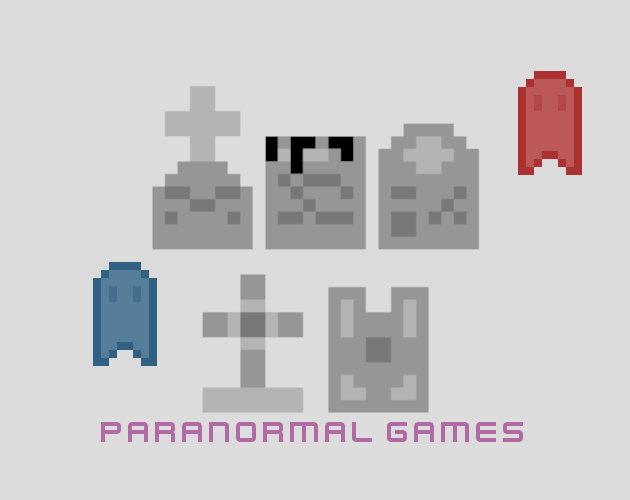

# Paranormal Games

*Olympic games, but with ghosts.*

[Full Changelog](https://github.com/FTEdianiaK/Paranormal-Games/compare/) | [License](https://github.com/FTEdianiaK/xxx/blob/main/LICENSE) | [Asset License](https://creativecommons.org/licenses/by-sa/4.0/)

### Features

### How to...

**Play:**
- Visit my [Itch](https://edianiak.itch.io/lm) for more information.

**Re-code:**
- Grab a zip of the whole repository using the 'Code' button above.
- Alternatively, use 'git clone'.
- Open using [Godot](https://godotengine.org/).

### Known Bugs
- None yet... Report them [here](https://github.com/FTEdianiaK/Paranormal-Games/issues).

### Credits

**Engine:** [Godot - by Godot Engine - MIT](https://godotengine.org/)

**Music:** [Bosca Ceoil - by Terry Cavanagh](https://boscaceoil.net/)

**Assets:** [by Kenney - CC0](https://kenney.nl/assets)
